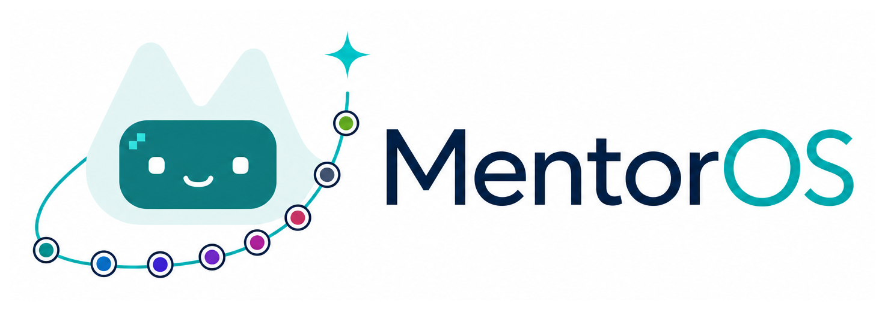
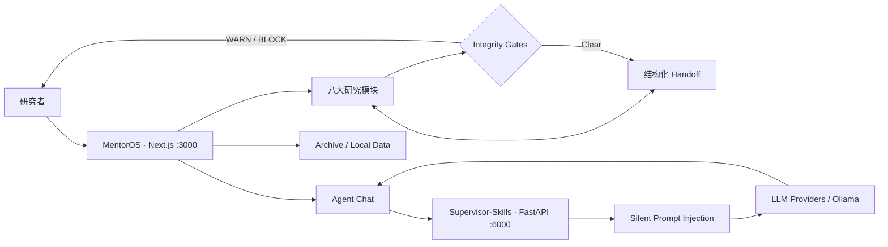

<p align="center">
  
</p>

<p align="center">
  <strong>人机协同导师工作台 · Human-in-the-loop Research Co-Supervisor</strong>
</p>

<p align="center">
  将文献、研究构思、实验、写作、图表、审稿与润色组织成一条<br />
  <strong>可追溯、可中断、有人类最终把关</strong>的科研工作流。
</p>

<p align="center">
  <a href="https://github.com/LostSirius/MentorOS/actions/workflows/ci.yml"></a>
  <a href="https://github.com/LostSirius/MentorOS/stargazers"></a>
  
  
  
  
  <a href="LICENSE"></a>
</p>

<p align="center">
  <a href="#项目概述">项目概述</a> ·
  <a href="#快速开始">快速开始</a> ·
  <a href="#系统架构">系统架构</a> ·
  <a href="#english">English</a> ·
  <a href="docs/distill/README.md">开发文档</a>
</p>

> [!IMPORTANT]
> MentorOS 是科研辅助工具，不替代研究者的事实核验、学术判断与责任。本项目采用 [PolyForm Noncommercial License 1.0.0](https://polyformproject.org/licenses/noncommercial/1.0.0)：允许个人学习、研究、教学与非营利科研，**禁止商业使用**。

---

<p align="center"><b>随模型切换的桌宠学伴</b></p>

<table align="center">
  <tr>
    <td align="center" width="16%">
      <br />
      <sub><b>GPT</b></sub>
    </td>
    <td align="center" width="16%">
      <br />
      <sub><b>Gemini</b></sub>
    </td>
    <td align="center" width="16%">
      <br />
      <sub><b>Grok</b></sub>
    </td>
    <td align="center" width="16%">
      <br />
      <sub><b>DeepSeek</b></sub>
    </td>
    <td align="center" width="16%">
      <br />
      <sub><b>Qwen</b></sub>
    </td>
    <td align="center" width="16%">
      <br />
      <sub><b>Claude</b></sub>
    </td>
  </tr>
</table>

<p align="center">
  <sub>运行时资源：<code>src/frontend/public/pets/qpack/</code> · 设计源：<code>assets/desktop-pet/</code></sub>
</p>

---

## 目录

- [项目概述](#项目概述)
- [八大研究模块](#八大研究模块)
- [系统架构](#系统架构)
- [核心能力](#核心能力)
- [技术栈](#技术栈)
- [项目结构](#项目结构)
- [快速开始](#快速开始)
- [Agent 技能](#agent-技能)
- [蒸馏文档](#蒸馏文档)
- [English](#english)
- [参与贡献](#参与贡献)
- [许可证](#许可证)

---

## 项目概述

大多数 AI 科研工具停留在单轮聊天：过程散落、阶段成果难以交接，引用和数字也缺少约束。MentorOS 把「协同导师」做成结构化工作台，让 Agent 在明确的研究阶段、证据规则和人工确认点内协作。

| 设计原则 | MentorOS 的做法 |
| :--- | :--- |
| 🧑‍🏫 **Co-Supervisor** | 根据意图静默注入学术技能；不把产品做成技能商店 |
| 🧭 **阶段化工作流** | 左侧模块导航与 Archive、中间研究画布、右侧 Agent 对话共享上下文 |
| 📦 **结构化交接** | 模块间通过 [`handoff.ts`](docs/distill/schemas/handoff.ts) 传递可验证的数据包 |
| 🛡️ **科研完整性** | 人在回路、证据纪律、致命缺陷检查，以及 `BLOCK / WARN` 门禁 |

> [!NOTE]
> [`docs/distill/`](docs/distill/README.md) 是八个研究模块的实现真源；README 负责产品导航，不替代模块规范。

---

## 八大研究模块

默认进入 **文献**。后半段：撰写 → 图表 → 审稿 → **润色**。

| 模块 | 核心产出 | 下一步 |
| :--- | :--- | :--- |
| 🧭 **总览 Overview** | Material Passport、状态、分数与缺口 | 推荐下一动作 |
| 📚 **文献 Literature** | 有出处的综述包、研究问题与空白 | Idea / 撰写 |
| 💡 **Idea** | 候选构思、五维评估与 `IdeaCard` | 实验 |
| 🧪 **实验 Experiment** | 锁定的实验配方、真实结果与诚实解读 | 撰写 |
| ✍️ **撰写 Writing** | 证据门控的大纲、分节与初稿 | 图表 |
| 📊 **图表 Figures** | Motivated example、方案总览与结果图 | 审稿 |
| 🔎 **审稿 Review** | 多视角预投稿审查与逐点回复提纲 | 润色 |
| ✨ **润色 Polish** | 按意见改稿与语义差异 | 人工确认 |

---

## 系统架构



本地单用户存储（`/api/local-db`），**不依赖 Supabase 账号**。`/zh` ↔ `/en` 软切换时尽量保留会话与附件。

---

## 核心能力

- 工作台：模块页、Archive、可折叠对话（快捷键 `e`）、Settings / API Keys
- 证据与门禁：`docs/distill/shared/*`；Idea 五维 Higher / Faster / Stronger / Cheaper / Broader
- 多模型对话与本地上传（PDF / DOCX / MD / TXT 等）
- 桌宠随当前模型换皮、随模块进度成长

---

## 技术栈

| 层 | 技术 |
| --- | --- |
| 前端 | Next.js 14 · React 18 · TypeScript 5 · Tailwind 3 · i18next |
| 存储 | 本地单用户 API |
| 后端 | FastAPI 0.111 · Uvicorn · `:6000` |
| Node | `.nvmrc` → **20.11.0** |

---

## 项目结构

```text
MentorOS/
├── README.md · LICENSE · CONTRIBUTING.md
├── docs/distill/                 # 模块实现真源
├── assets/desktop-pet/           # 桌宠设计源
├── scripts/dev.ps1
└── src/
    ├── backend/                  # FastAPI :6000
    └── frontend/                 # Next.js :3000
        └── public/
            ├── logo-readme.png
            └── pets/qpack/       # GPT · Gemini · Grok · DeepSeek · Qwen · Claude
```

---

## 快速开始

**环境：** Node.js 20 · Python ≥ 3.10 · 至少一个 LLM API Key（或 Ollama）

### 1. 获取项目

```bash
git clone https://github.com/LostSirius/MentorOS.git
cd MentorOS
```

### 2. 配置密钥

```bash
cd src/frontend
cp .env.local.example .env.local
```

按需在 `.env.local` 填入 `OPENAI_API_KEY`、`ANTHROPIC_API_KEY`、`GOOGLE_GEMINI_API_KEY` 等；也可以启动后在 **Settings → API Keys** 中设置。

> [!WARNING]
> `.env.local` 已被 Git 忽略。不要把真实 API Key 写入源码、Issue、日志或提交历史。

### 3. 启动后端

```bash
cd src/backend
pip install -r requirements.txt
python main.py          # http://localhost:6000
```

### 4. 启动前端

```bash
cd src/frontend
npm install
npm run dev             # http://localhost:3000
```

在浏览器打开 **[http://localhost:3000](http://localhost:3000)**。Windows 也可以在仓库根目录执行 `.\scripts\dev.ps1`。

| 命令 | 作用 |
| --- | --- |
| `npm run dev` | 开发服务器 |
| `npm run build` / `start` | 生产构建 |
| `npm run type-check` | TypeScript |
| `npm test` | Jest |

<details>
<summary><b>常见启动问题</b></summary>

- `:3000` 已被占用：关闭旧的 `next dev` 进程后重启。
- 出现 `vendor-chunks` 缺失：停止前端，删除 `src/frontend/.next`，再运行 `npm run dev`。
- Agent 技能不可用：确认 FastAPI 后端已在 `:6000` 启动。

</details>

---

## Agent 技能

运行时：`src/backend/plugins/phd-research/skills/`，与 `docs/distill/injectable/*` 静默叠加。**产品 UI 不展示 skill 名。** 详见 [`INTEGRATIONS.md`](INTEGRATIONS.md)。

| Skill | 用途 |
| --- | --- |
| `literature-review` · `deep-research` | 文献 |
| `brainstorm` · `idea-evaluator` | Idea |
| `benchmark-paper-template` | 实验 |
| `paper-writer` · `intro-drafter` | 撰写 |
| `figure-designer` | 图表 |
| `pre-submission-reviewer` · `scientific-feedback` | 审稿 |
| `paper-polish` | 润色 |

---

## 蒸馏文档

| 文档 | 用途 |
| --- | --- |
| [docs/distill/README.md](docs/distill/README.md) | 蒸馏包 |
| [docs/distill/modules/](docs/distill/modules/) | 分模块 playbook |
| [docs/distill/shared/](docs/distill/shared/) | HITL / 证据 / 门禁 |
| [docs/distill/schemas/handoff.ts](docs/distill/schemas/handoff.ts) | 交接契约 |

---

## English

**MentorOS** is a local research workbench: eight modules plus an agent chat that injects academic skills silently. Humans keep claims and publication decisions; the app does not auto-submit papers.

```text
literature → idea → experiment → writing → figures → review → polish → overview
```

Quick start: `python main.py` in `src/backend`, `npm run dev` in `src/frontend`. License: **noncommercial** — see [`LICENSE`](LICENSE).

---

## 参与贡献

请阅读 [`CONTRIBUTING.md`](CONTRIBUTING.md) 与 [`CODE_OF_CONDUCT.md`](CODE_OF_CONDUCT.md)。安全问题走 [`SECURITY.md`](SECURITY.md)。

曾用名 Scholar Canvas / 学导画布：浏览器会尝试把 `scholar-canvas-*` 迁移为 `mentoros-*`。

### 致谢

[Supervisor-Skills](https://github.com/HKUSTDial/Supervisor-Skills) · [LLM-scientific-feedback](https://github.com/Weixin-Liang/LLM-scientific-feedback) · Orchestra / AERS / AI-Scientist 等（见 `docs/distill/sources/`）· [chatbot-ui](https://github.com/mckaywrigley/chatbot-ui)

---

## 许可证

[PolyForm Noncommercial License 1.0.0](https://polyformproject.org/licenses/noncommercial/1.0.0) — **禁止商业使用**。全文见 [`LICENSE`](LICENSE)。
